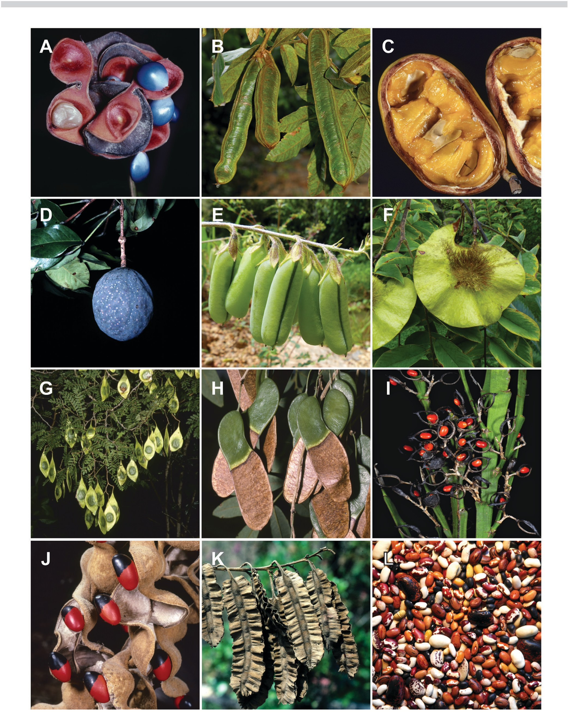
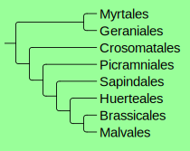
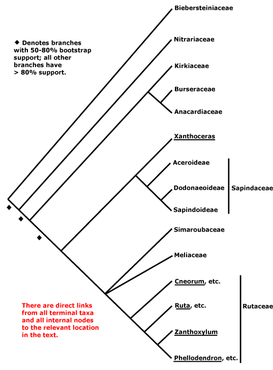

## Bienvenidos al curso de botánica Taxonómica para Ingenieros Agrícolas

El curso está dirigido a los estudiantes de la carrera de Ingeniería Agrícola, tiene una duración de 80 horas, asignadas en 16 semanas. Se dedicarán 32 horas a clases magistrales, 48 a laboratorio. Se presentarán los fundamentos y métodos de la Taxonomía y Sistemática Botánica, capacitando a los alumnos para su manejo y aplicación, mediante el estudio y caracterización de las principales familias botánicas de importancia agronómica y económica en el país. El estudiante aprenderá a hacer colecciones botánicas, identificación y descripción de familias y especies vegetales, a llevar una libreta de campo, a consultar bibliografía pertinente, y a presentar los resultados de sus investigaciones y aprendizaje.

## Objetivos de aprendizaje

Al final del curso los estudiantes estarán en capacidad de:

* Comprender los fundamentos teóricos y prácticos de la Taxonomía y la Sistemática Vegetal y su papel en el reconocimiento y estudio de las plantas útiles.
* Entender las bases biológicas y metodológicas del proceso de clasificación.
* Presentar los conceptos teóricos en sistemática, enfatizando en las nuevas escuelas (sistemática filogenética) y sus propuestas de clasificación.
* Dar a conocer los diferentes elementos de la sistemática botánica, el estado actual de su desarrollo, su posible futuro y la importancia de su aplicación.
* Dar una visión amplia de la clasificación y de las características generales de los órdenes y familias de angiospermas más representativas de Colombia, destacando las especies de valor económico, a nivel de malezas, cultivos y plantas ornamentales.
* Evaluar y reconocer los principales caracteres diagnósticos para la identificación de material fresco y de herbario a través de la aplicación de claves botánicas.
* Reforzar el estudio de las características morfológicas y botánicas de las familias para lograr su reconocimiento en el campo.
* Considerar el trabajo taxonómico como parte fundamental y apoyo importante a la investigación en agronomía

# Semana 10 (11 al 15 de mayo). Fabidas 2/2

## Familia Fabaceae
La familia más diversa y económicamente importante de este orden es Fabaceae, allí encontramos especies tan importantes como el frijol (Phaseoulus vulgare), la arveja (Pisum sativum) y la lenteja [(Lens culinaris)](https://es.wikipedia.org/wiki/Lens_culinaris).

Un cambio fundamental se dio hace poco en la clasificación de esta familia [LPWG 2017](https://scinapse.io/papers/2591630414), es este artículo se propone, de forma resumida, la clasificación tradicional incluye tres familias, Momosoideae, Caesalpinioideae, y Papilionoideae, con la nueva clasificación, dado que la subfamilia Caesalpinioideae es parafilética, se desició agragar tres nuevas subfamilias e incluir a Mimosoideae dentro de Caesalpinioideae.

Tradicionalmente estas eran las caracteristicas que permitian reconocer las tres subfamilias

Caracter | Papilionoideae | Caesalpinioideae | Mimosoideae 
---------|----------------|------------------|------------
Simetría floral | Claramente monosimétrica, papilionada | Débilmente monosimétrica | actinomorfa
Número de estambres | generalmente 10 | generalmente 10 | incontables
División de las hojas | trifolioladas o imparipinadas | pinadas o bipinadas | generalmente bipinadas (excepto en *Inga*)
Nectarios extraflorales | ausentes | poco comunes | muy comunes

### *Actividad de la semana*
Leerán por lo menos las cinco primeras páginas el artículo de [Yahara et al. 2013](https://scinapse.io/papers/2021369172), que también está disponible en el [Drive](https://drive.google.com/drive/u/1/folders/1UP3_kcpkwKeg_e1UIyjlxf05HyVDmhMV) y en Moodle.
  

# Semana 11. Malvidas
Este clado, junto con las Fabidas, conforma las Rosidas nucleares. Está compuesto por 8 órdenes, de los cuales, Myrtales y Geraniales forman un clado cuyas relaciones con los otros no está claramente resuelta.

Estas son las relaciones entre los ordenes de Malvidas.

A continuación les presento un resumen de los órdenes y familias que vimos en la clase. 

## Myrtales

 familia | hojas | fórmula floral | caracteres clave
---------|-------|----------------|----------------
Myrtaceae | simples-opuestas | * , K(4-5), C (4-5), A (∞), Ĝ (-2-5-) | hojas con puntos translucidos, venación broquidódroma
Melastomataceae | simples-opuestas | * ó ↓, [K(3-6), C (4-5), A (∞)], Ĝ (2-10) | venación acródroma 

### familia Myrtaceae

Una familia de gran importancia agrícola, allí encontramos varias especies comestibles como:

* Guayaba (*Psdium guajava*)
* Feijoa (*Acca sellowiana*)
* Guayaba Agria (*Psidium friedrichsthalianum*)

Numerosas especies maderables y ornamentales introducidas de Australia:

* Eucalipto (*Eucalyptus globulus*, *Eucalyptus camandulensis*, *Eucalyptus cinerea*, *Eucalyptus grandis*, 
* Eucalyptus recinifera*, *Corymbia fiscifolia*) 
 
 Algunas especies nativas que se cultivan en el arbolado urbano de Bogotá:

* Arrayán (*Myrcianthes leucoxyla*)
* Arrayán Negro (*Myrcianthes rophaloides*)

### familia Melastomataceae

Según el [catálogo de las plantas de Colombia](http://catalogoplantasdecolombia.unal.edu.co/es/), en Colombia existen 60 géneros y 987 especies de esta familia. Es especialmente diversa en bosques andinos, y es frecuentemente una de las familias dominantes en el estrato arbóreo. 

## Brassicales

Un orden con 19 familias de muy amplia variación morfológica, sin embargo comparten un caracter químico, la presencia de aceites volátiles de mostaza o glucosinatos. La mayoría de las Brassicales presentan flores tetrámeras, aunque el estado plesiomorfico posiblemente sea de flores pentámeras. Presenta una tendencia hacia las flores monosimétricas, presencia de ginóforo, ovario curvado y óvulos campilótropos. El ginóforo aunque también se presenta en varias familias de Malvales, es especialmente conspicuo en este orden. 

En APG II la familia fue tratada, incluyendo las familias Caparaceae y Cleomacea, las que posteriormente fueron segregadas como familias separadas, con evidente justificación morfológica.

Este es una tabla comparativa de las dos familias de Brassicales que vimos en clase.

familia | hojas | fórmula floral | caracteres clave
--------|-------|----------------|------------------
Brassicaceae | simples-alternas, en rosetas basales | * ó ↓ K4 C4 A(2-)6-∞ G (2) | estambres tetradínamos, frecuentemente fruto en silicua
Caricaceae | simples(lobuladas)-alternas | est * K5 [C(5), A5+5,] G0, pis * K5 [C(5) A5+5] G0 | Crecimiento paquicaule     

La importancia económica del orden recae en gran parte en una especie, *Brassica oleracea*. Posiblemente originaria del Asia menor, esta especie produce distintos productos comestibles a partir de la proliferación o modificación en distintas partes vegetativas. Así, la variedad *acephala* es la Col común, de la cual se consumen sus hojas, el Coliflor y el Brócoli son la variedad *botrytis*, en el cual se consumen principalmente los ejes de la inflorescencia, bracteas y botones florales, las Coles de Bruselas, son lavariedad *gemmifera*, de la cual se consumen los brotes que se agrupan a lo largo de un eje central prolongado, con las hojas en el ápice, y el Repollo es la variedad *capitata*, en la cual las hojas se presentan firmemente sobrelapadas, de estos los hay de colores blanco, verde, rojo y morado.       

## Sapindales

En este orden encontramos 9 familias, de las cuales vimos cuatro en la clase. Las flores son casi siempre de tamaño pequeño y agrupadas en inflorescencias cimosas. A diferencia de las Brassicales, donde predominan las herbáceas, aquí principalmente hay plantas leñosas. En términos generales las flores son típicas dentro de las Rosidas, siendo casi siempre polisimétricas, y 4 o 5-meras, los pétalos libres e imbricados, y los estambres diplostemonos

>_Estambres diplostemonos_: Que son el doble de lo pétalos. Y asociados a esto obdiplostemonos, cuando la serie externa de estambres es opuesta a los pétalos, lo que contrario a la regla de alternancia de las partes florales.

El gineceo es súpero, frecuentemente del mismo número que partes del perianto (isomero), o reducido a 2 o 3 carpelos, con placentación axilar.
  

familia | hojas | fórmula floral | caracteres clave
--------|-------|----------------|------------------
Rutaceae | simples o compuestas, alternas o ráramente opuestas  |* K(4-5) C(4-6) A(4-∞) G(4-∞) | estambres tetradínamos, frecuentemente fruto en silicua
Meliaceae | Pinadas (raramente bipinadas), alternas | * K(4-5) C4-6 A(4-10) G(2-6) | estambres fusionados formando un tubo estaminal
Anacardiaceae | compuestas o simples (raramente simples en el neotrópico), alternas |est * K(5) C5 A5-10 G(3-5). pis * K(5) C5 A5-10. G(3-5) | resina aromática  
Sapindaceae | Pinadas, trifolioladas o biternadas (raramente simples o unifolioladas) | est * K(4-5) C4-5 A4-8 G(0 ó 2-3). pis * K(4-5) C4-5 A4-8. G(2-3) | en las especies arbóreas un mucrón apical en las hojas, en las lianas es común la presencia de exudado blanco   

Vegetativamente este grupo suele ser confundido con especies de la familia Fabaceae, por esto en la siguiente tabla hay algunas pistas para diferenciarlas.

Caracter | Fabaceae     | Sapindales
---------|--------------|-----------
Estípulas | siempre presentes| presentes solo en las trepadoras
pulvinulos | presentes | ausentes (pero pueden tener engrosamiento no cilíndricos)
Aroma | poco común | común en Rutaceae, Ancardiaceae y Burseraceae

Las relaciones filogenéticas entre las familias muestran que Anacardiaceae y Burseraceae están estrechamente relacionadas, lo que se evidencia en la morfología. Por su parte, Sapindaceae incluye tres subfamilias, las cuales eran tratadas anteriormente como familias.

## Especies de interés económico

Numerosas especies de Meliaceae son maderables, como el Cedro (*Cedrela montana*, *Cedrela odorata*), y el Caobo *Swietenia macrophylla*. 
En Sapindaceae se encuentran numerosas frutas asiáticas, de las cuales es consumido el arilo de sus frutos en drupa, originario de América es el Mamoncillo (*Meliccocus bijugatus*), que se cosecha en temporada a partir de arboles no cultivados. Otro producto importante de la Amazonia es el Guaraná (*Paullinia cupana*), de cuyas semillas se extraen bebidas energéticas y otros productos estimulantes, nutricionales y medicinales.
En Rutaceae encontramos que el género *Citrus* incluye numerosas especies cuyos frutos, llamados cítricos, son ampliamente consumidos alrededor del mundo, la Ruda (*Ruta graveolens*) es usada para el tratamiento de numerosas dolencias.

# Semana 12. Superasteridas 1

## Orden Caryophyllales
Este es un grupo actualmente bien establecido, de 37 familias

Este grupo está ubicado en la segunda edición del libro dentro de las Rosidas basales, sin embargo a partir de la segunda versión del [APG](https://scinapse.io/papers/2166152751), están ubicadas en dentro de las Asteridas basales.

# Trabajo final

El trabajo final consistirá en en la elaboración de un ensayo de de máximo 10 páginas (incluyendo imágenes y la bibliografía), letra Arial 12, espacio sencillo. En el cual cada estudiante abordará los siguientes aspectos de la especies que le corresponda.

* Nomenclatura: En esta parte se debe investigar y presentar la historia taxonómica de la especie; quien la describió por primera vez, en que obra, si han habido cambios a otros géneros o familias, etc.

* Descripción morfológica, siguiendo los parámetros de las descripciones taxonómicas, pueden guiarse por descripciones como las de Flora de Colombia, por ejemplo la descripción de [Cydista divesifolia](http://www.biovirtual.unal.edu.co/floradecolombia/es/description/304/).

* Relaciones filogenéticas y biogeografía: 

* Usos: recopilación de información sobre los usos potenciales y actuales de la especie asignada.

    
